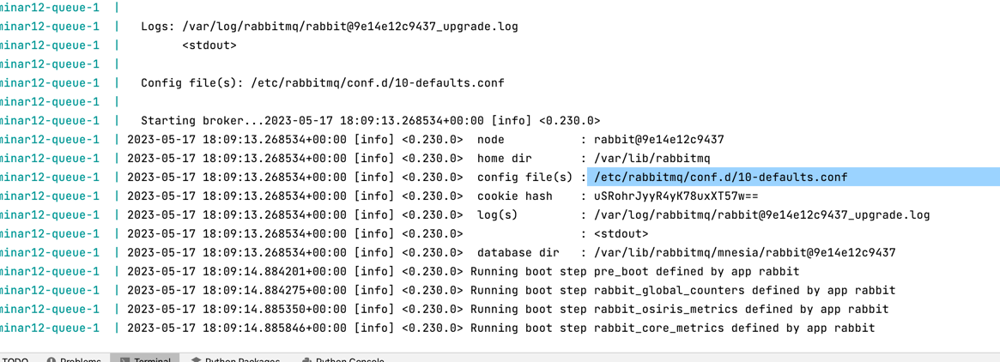

###Конфинг RabbitMQ

При запуске ```docker-compose up queue```

Конфиг явно указан в логе :)


Внутри контейнера можно смотреть статус с помощью встроенной утилиты
```
rabbitmq-diagnostics status

rabbitmq-diagnostics environment
```

Сам конфиг изначально пустой, потому что как говорится в документации :)
```buildoutcfg
RabbitMQ comes with default built-in settings
```

### Типы exchange

https://medium.com/trendyol-tech/rabbitmq-exchange-types-d7e1f51ec825


### Что почитать/посмотреть?

https://medium.com/cuddle-ai/async-architecture-with-fastapi-celery-and-rabbitmq-c7d029030377


https://itracer.medium.com/rabbitmq-publisher-and-consumer-with-fastapi-175fe87aefe1

