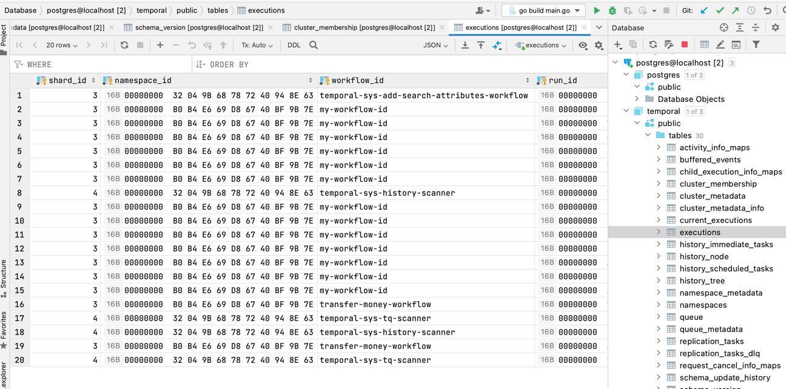

### Полезные ссылки

* [Описание temporal](https://temporal.io/blog/workflow-engine-principles)

* [NoSQL БД](https://blog.bytebytego.com/p/understanding-database-types)

* [Документация Temporal Python](https://python.temporal.io/)

* [Запуск из docker-compose кластера](https://github.com/temporalio/docker-compose)

* [SDK python](https://github.com/temporalio/sdk-python)

* [Описание Temporal на habr](https://habr.com/ru/companies/oleg-bunin/articles/666158/)

Если вам не хватит ресурсов контейнера, можете увеличить лимиты
```buildoutcfg
colima start --cpu 6 --memory 10
```


Схема БД


[https://temporal.io/blog/workflow-engine-principles]: https://temporal.io/blog/workflow-engine-principles